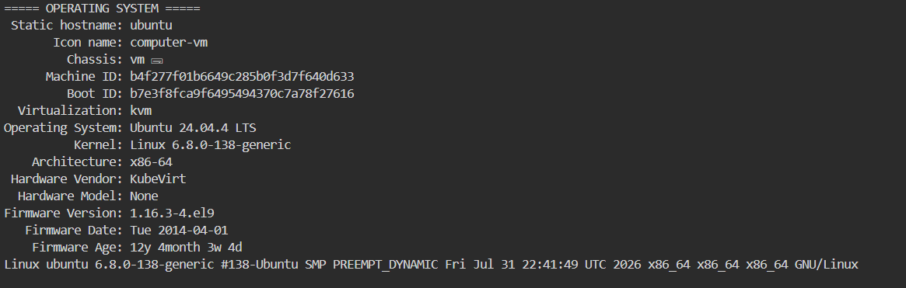
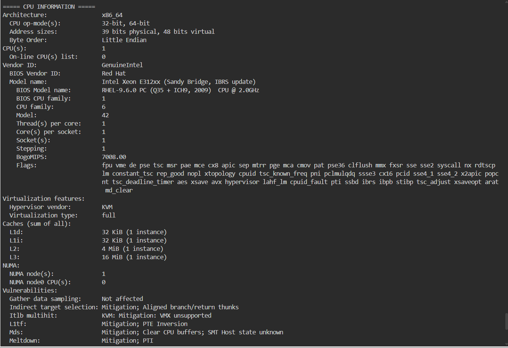
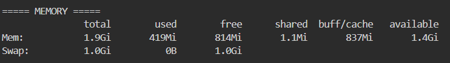
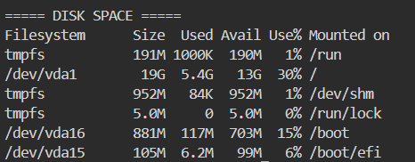

# Laboratory 3 – Multi-Cloud Explorer

Cloud Evaluation Team mission for CloudNova Technologies: researching AWS, Microsoft Azure, and Google Cloud Platform (GCP), comparing their services, and recommending suitable cloud platforms for different client scenarios.

## Contents

- `aws-research.md` – AWS overview and core services
- `azure-research.md` – Azure overview and core services
- `gcp-research.md` – GCP overview and core services
- `cloud-platform-comparison.md` – Cloud platform comparison and service-matching tables
- `client-recommendations.md` – Recommendations for Clients A–D and decision matrix
- `reflection.md` – Mission reflection
- `screenshots/` – Evidence for each checkpoint

## Checkpoint 7 – Linux Investigation

**Operating System:** Ubuntu 24.04.4 LTS, Kernel 6.8.0-138-generic, x86_64 architecture, running as a KVM virtual machine

**CPU:** 1 vCPU, Intel Xeon E312xx (Sandy Bridge), x86_64, 1 socket / 1 core / 1 thread, 16 MiB L3 cache

**Memory:** 1.9 GiB total, 817 MiB free, 1.4 GiB available, 1.0 GiB swap

**Disk Space:** 19 GB total on root (`/dev/vda1`), 5.4 GB used, 13 GB available, approximately 30% used

### Cloud Hosting Options

Given the small footprint of this Linux server (1 vCPU, approximately 2 GB RAM, and approximately 19 GB of disk space), it can be hosted using small general-purpose or burstable virtual machine instances across AWS, Microsoft Azure, and Google Cloud Platform.

- **AWS:** Amazon EC2 can host the server using a small instance such as `t3.micro` or another appropriately sized instance. The operating system disk can be stored on Amazon EBS using a General Purpose SSD volume of approximately 20 GB.

- **Microsoft Azure:** Azure Virtual Machines can host the server using a small instance such as `B1s` or `B1ms`, depending on the required memory and workload. The operating system disk can be stored using an Azure Managed Disk with approximately 20 GB of storage.

- **Google Cloud Platform:** Compute Engine can host the server using a small machine type such as `e2-micro` or `e2-small`, depending on the workload and required resources. The virtual machine can use a Persistent Disk with approximately 20 GB of storage.

### Personal Choice

I would personally choose **AWS** for this server because Amazon EC2 provides flexible instance options and can easily scale if the server requires additional CPU or memory in the future. AWS also provides Amazon EBS for persistent storage and a wide range of networking, security, and monitoring services. Since the server has a small resource footprint, I could start with a low-cost instance and increase its resources only when necessary.

### Terminal Evidence

**Operating System check:**

**CPU information:**

**Memory information:**

**Disk space:**

