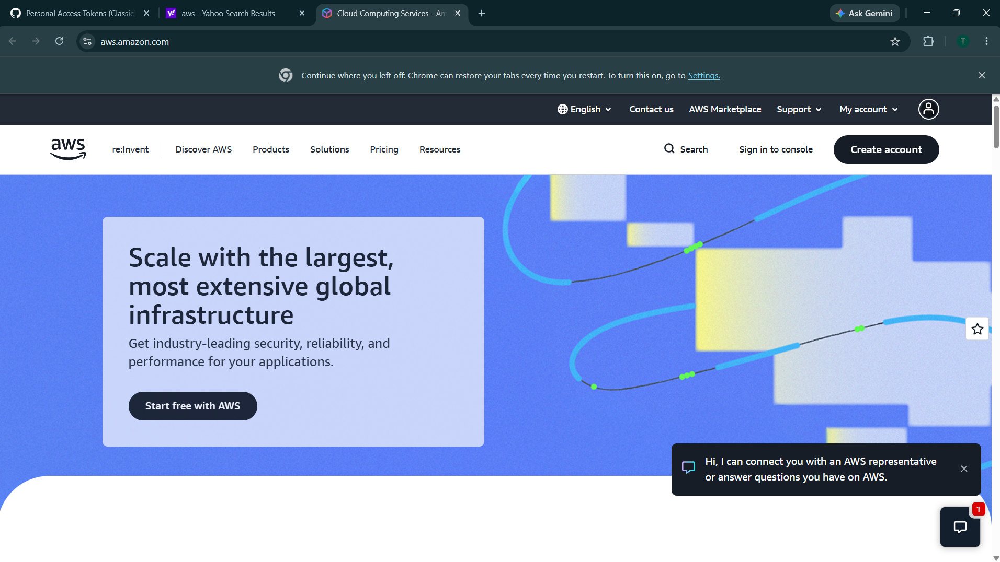

# Amazon Web Services (AWS) Research

## Brief Overview

Amazon Web Services (AWS) is a cloud computing platform provided by Amazon. It offers a wide range of cloud-based services, including computing, storage, databases, networking, security, analytics, artificial intelligence, and machine learning. AWS allows organizations to access IT resources over the internet without having to purchase and maintain all of their own physical servers and infrastructure.

AWS was launched in 2006 by Amazon. Its first major service, Amazon Simple Storage Service (Amazon S3), was launched in March 2006. AWS is owned and operated by Amazon.com, Inc. Today, AWS provides cloud services to startups, enterprises, government organizations, educational institutions, and other customers around the world.

## Global Infrastructure

AWS has one of the largest cloud infrastructures in the world. As of 2026, AWS has 39 geographic Regions and 124 Availability Zones. AWS also has more than 750 CloudFront Points of Presence around the world.

An AWS Region is a separate geographic area where AWS operates its cloud infrastructure. Each Region contains multiple Availability Zones (AZs). Availability Zones are isolated locations within a Region and are designed to operate independently while being connected through redundant, low-latency networks. This architecture helps organizations build applications that are highly available and fault tolerant.

## Cloud Management Console

The AWS Management Console is a web-based interface used to manage AWS cloud services and resources. Users can use the console to create and configure services, monitor resources, manage security settings, view billing information, and control their cloud infrastructure.

For example, users can launch virtual servers using Amazon EC2, create storage buckets using Amazon S3, configure databases using Amazon RDS, and manage networking resources through the console.

## Four (4) Core Services

1. **Amazon EC2 (Elastic Compute Cloud)** – Provides virtual servers that users can create and configure in the AWS Cloud. It is commonly used for hosting websites, applications, databases, and other workloads.

2. **Amazon S3 (Simple Storage Service)** – Provides object storage for storing and retrieving files and other types of data. It can be used for documents, images, videos, backups, application data, and large datasets.

3. **Amazon RDS (Relational Database Service)** – Provides a managed relational database service. It makes it easier to set up, operate, maintain, and scale relational databases without managing the underlying server infrastructure.

4. **AWS Lambda** – Provides serverless computing that allows developers to run code without provisioning or managing servers. It is commonly used for event-driven applications, APIs, automation, and backend processing.

## Three (3) Advantages

1. **Scalability** – AWS allows organizations to increase or decrease cloud resources according to demand. This makes it possible to handle sudden increases in users or workloads without purchasing additional physical servers.

2. **Global Availability** – AWS has infrastructure distributed across many geographic Regions and Availability Zones. Organizations can deploy applications in different locations to improve availability, performance, and disaster recovery.

3. **Pay-as-you-go Pricing** – AWS provides usage-based pricing for many services. Instead of making a large upfront investment in physical hardware, organizations can pay for the resources they use.

## Typical Enterprise Use Cases

- **Web and Application Hosting** – Enterprises can use AWS to host websites, APIs, mobile applications, and business applications.

- **Data Storage and Backup** – Organizations can use Amazon S3 and other AWS storage services to store business files, backups, archives, and large amounts of data.

- **Database Management** – Companies can use Amazon RDS and other AWS database services to run and manage databases while reducing the need for manual infrastructure administration.

- **Data Analytics** – Enterprises can process and analyze large amounts of business data using AWS analytics and data-processing services.

- **Artificial Intelligence and Machine Learning** – Organizations can use AWS AI and machine-learning services to develop applications such as recommendation systems, predictive analytics, automation, and generative AI solutions.

- **Disaster Recovery** – Businesses can use AWS infrastructure to create backup systems and recovery environments for critical applications and data.

- **Software Development and Testing** – Development teams can create temporary environments for developing, testing, and deploying applications without purchasing additional physical hardware.

## Conclusion

Amazon Web Services is a major cloud computing platform that provides organizations with scalable, flexible, and globally distributed IT infrastructure. Since its launch in 2006, AWS has expanded from basic storage and computing services into a broad cloud platform with hundreds of services. Its global infrastructure, pay-as-you-go model, and wide range of services make it suitable for businesses of different sizes and industries.
