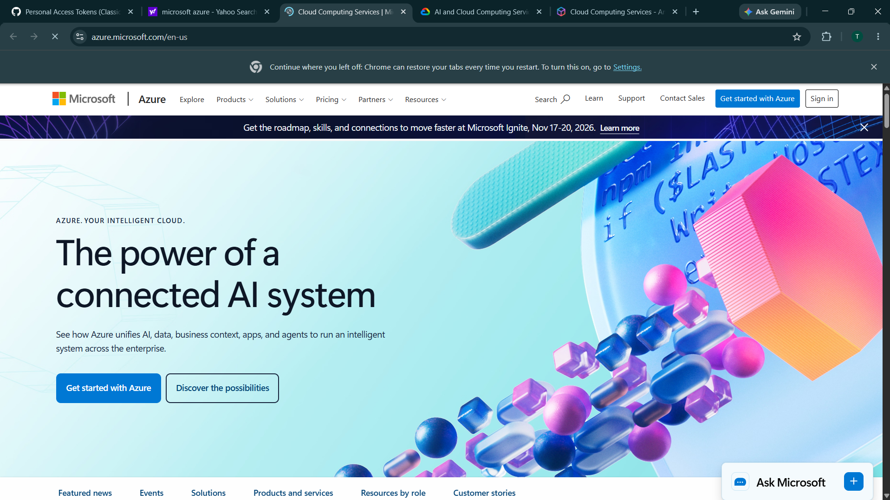

# Microsoft Azure Research

## Brief Overview

Microsoft Azure is a cloud computing platform developed by Microsoft. It provides a wide range of cloud services, including computing, storage, networking, databases, artificial intelligence, analytics, and security. Organizations can use Azure to build, deploy, manage, and scale applications and IT infrastructure through the internet.

Azure was officially launched in **2010** as Windows Azure and was later renamed **Microsoft Azure** in 2014. It is owned and operated by **Microsoft** and is used by businesses, governments, educational institutions, and developers around the world.

## Global Infrastructure

Microsoft Azure has a large global cloud infrastructure consisting of **more than 70 regions** and **more than 400 datacenters** worldwide. Azure Regions are geographic areas that contain one or more datacenters. Many Azure regions also support Availability Zones, which are physically separate locations within an Azure region designed to provide high availability and fault tolerance.

Azure's global infrastructure allows organizations to deploy applications and services closer to their customers, helping improve performance, availability, and reliability.

## Cloud Management Console

The **Microsoft Azure Portal** is a web-based management interface that allows users to create, configure, monitor, and manage Azure resources and services. Users can manage virtual machines, storage accounts, databases, networking, security, identities, applications, and many other cloud resources through the portal.

The Azure Portal also provides dashboards, monitoring tools, resource management features, billing information, and access to different Azure services from a single interface.

## Four (4) Core Services

1. **Virtual Machines** – Azure Virtual Machines provide on-demand, scalable computing resources in the cloud. Users can create virtual servers running operating systems such as Windows or Linux and use them to host applications, websites, databases, and other workloads.

2. **Blob Storage** – Azure Blob Storage is an object storage service designed for storing large amounts of unstructured data such as documents, images, videos, backups, logs, and other files.

3. **Virtual Network** – Azure Virtual Network allows users to create private networks in Azure and securely connect cloud resources such as virtual machines, databases, and applications. It provides networking features such as IP addressing, routing, subnets, and network security.

4. **Microsoft Entra ID (formerly Azure Active Directory)** – Microsoft Entra ID is Microsoft's cloud-based identity and access management service. It helps organizations manage users, applications, devices, and access to resources while providing authentication and security features such as multi-factor authentication.

## Three (3) Advantages

1. **Global Reach** – Azure provides cloud infrastructure in many geographic locations around the world. This allows organizations to deploy applications closer to their customers and support users in different regions.

2. **Scalability and Flexibility** – Azure allows organizations to increase or decrease computing, storage, and networking resources based on their requirements. This makes it suitable for workloads that change over time.

3. **Strong Integration with Microsoft Products** – Azure integrates closely with Microsoft technologies such as Windows Server, Microsoft 365, SQL Server, GitHub, and Microsoft Entra ID. This can make it easier for organizations already using Microsoft products to adopt cloud services.

## Typical Enterprise Use Cases

- **Application and Website Hosting** – Enterprises can use Azure Virtual Machines, App Service, and other Azure services to host websites, APIs, and business applications.

- **Data Storage and Backup** – Organizations can use Azure Blob Storage and other Azure storage services to store documents, backups, archives, media files, and other business data.

- **Identity and Access Management** – Companies can use Microsoft Entra ID to manage employee identities, authentication, permissions, and secure access to applications and cloud resources.

- **Hybrid Cloud Infrastructure** – Enterprises can connect their existing on-premises infrastructure with Azure cloud services to create hybrid cloud environments.

- **Artificial Intelligence and Data Analytics** – Organizations can use Azure AI and analytics services to process data, build machine learning solutions, and develop intelligent applications.

- **Disaster Recovery and Business Continuity** – Businesses can use Azure services to create backup and disaster recovery solutions for critical applications and data.

## Conclusion

Microsoft Azure is a comprehensive cloud computing platform that provides organizations with computing, storage, networking, identity, security, artificial intelligence, and other cloud services. Its global infrastructure, scalability, and integration with Microsoft's existing technologies make Azure a popular choice for enterprises and organizations that want to migrate, develop, and manage applications in the cloud.
