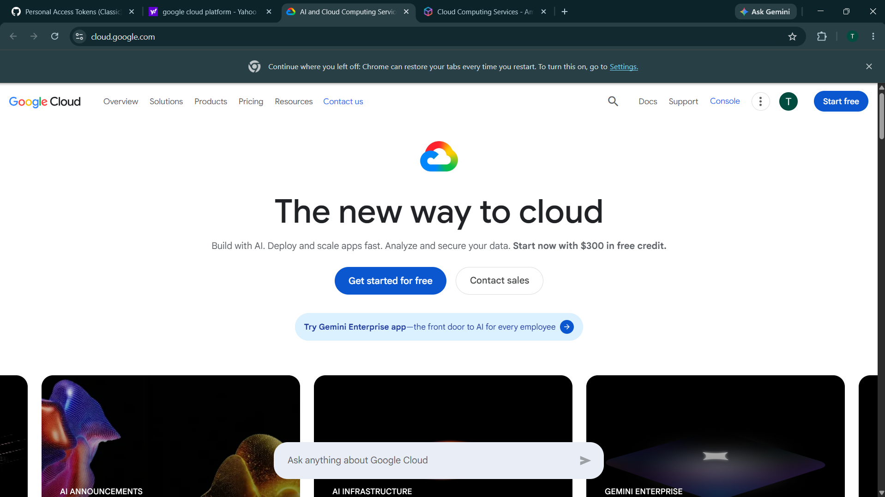

# Google Cloud Platform (GCP) Research

## Brief Overview

Google Cloud Platform (GCP), commonly known as Google Cloud, is a cloud computing platform developed and operated by Google. It provides a wide range of cloud services, including computing, storage, databases, networking, artificial intelligence, machine learning, analytics, and security. Organizations can use Google Cloud to build, deploy, manage, and scale applications and IT infrastructure.

Google Cloud was launched in **2008**, initially with the introduction of Google App Engine. It has since expanded into a large cloud platform used by businesses, governments, educational institutions, developers, and other organizations around the world. Google Cloud is owned and operated by **Google**, a subsidiary of Alphabet Inc.

## Global Infrastructure

Google Cloud has a global infrastructure made up of **regions** and **zones** distributed around the world. A Google Cloud region is a geographic location containing multiple zones. Zones are isolated locations within a region that are designed to provide high availability and reliability.

Google Cloud's global infrastructure allows organizations to deploy applications and services closer to their users. This can help improve application performance, availability, and reliability while supporting workloads across different geographic locations.

## Cloud Management Console

The **Google Cloud Console** is a web-based management interface that allows users to create, configure, monitor, and manage Google Cloud resources and services. Through the console, users can manage virtual machines, storage, databases, networking, security, identity, monitoring, and many other cloud services.

The Google Cloud Console also provides dashboards, resource management tools, billing information, monitoring features, and access to Google Cloud services from a centralized interface.

## Four (4) Core Services

1. **Compute Engine** – Google Compute Engine provides scalable virtual machines that run on Google's infrastructure. Users can create and configure virtual servers to host websites, applications, databases, and other workloads.

2. **Cloud Storage** – Google Cloud Storage is an object storage service used to store and retrieve large amounts of data. It can be used for documents, images, videos, backups, archives, application data, and other files.

3. **VPC (Virtual Private Cloud)** – Google Cloud VPC provides networking capabilities that allow organizations to create and manage private networks for their cloud resources. It supports features such as subnets, IP addresses, routing, firewall rules, and secure connections.

4. **Cloud IAM (Identity and Access Management)** – Cloud IAM allows organizations to control who can access Google Cloud resources and what actions they are allowed to perform. It helps administrators manage users, service accounts, roles, and permissions.

## Three (3) Advantages

1. **Global Infrastructure** – Google Cloud provides infrastructure across many geographic regions and zones around the world. This allows organizations to deploy applications closer to their users and improve availability and performance.

2. **Scalability and Flexibility** – Google Cloud allows organizations to scale computing, storage, networking, and other resources based on workload requirements. This makes it suitable for both small applications and large enterprise systems.

3. **Advanced Data and AI Capabilities** – Google Cloud provides powerful data analytics, artificial intelligence, and machine learning services. Organizations can use these technologies to analyze large datasets, automate processes, and develop intelligent applications.

## Typical Enterprise Use Cases

- **Web and Application Hosting** – Enterprises can use Compute Engine and other Google Cloud services to host websites, APIs, business applications, and backend systems.

- **Data Storage and Backup** – Organizations can use Cloud Storage to store business files, backups, archives, media, and other large datasets.

- **Data Analytics and Business Intelligence** – Companies can use Google Cloud analytics services to process and analyze large amounts of business data and generate useful insights.

- **Artificial Intelligence and Machine Learning** – Enterprises can use Google Cloud AI and machine learning services to develop predictive models, intelligent applications, automation, and generative AI solutions.

- **Networking and Hybrid Cloud** – Organizations can use Google Cloud VPC and networking services to securely connect cloud resources with on-premises infrastructure and other environments.

- **Identity and Access Management** – Businesses can use Cloud IAM to manage user permissions and control access to cloud resources and applications.

## Conclusion

Google Cloud is a comprehensive cloud computing platform that provides computing, storage, networking, identity management, data analytics, artificial intelligence, and other cloud services. Its global infrastructure, scalability, and strong capabilities in data and AI make it a suitable platform for organizations ranging from small development teams to large enterprises.
